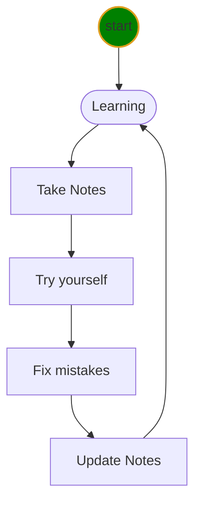

<h1> java level-1 class</h1>

This is a Java class for Houston Huaxia Chinese School.

## Document links
* [Java Class Notes](java1/doc/learnJava.md)
* [Eclipse Tricks](java1/doc/eclipseTricks.md)
* [Key board](java1/doc/keyboard.md)
* [Markdown Tricks](java1/doc/markdownTricks.md)
* [Git Tricks](java1/doc/gitTricks.md)
* [Markdown Shared Lib](java1/doc/myIcons.md)

## File Structure
<project root>
    ├── 📝doc/
    |    ├── mistakes.md 
    |    ├── markdownTricks.md 
    |    └── learnJava.md 
    ├── 🔨homeworks/
    |       └── <filenameXX.md>
    ├── emma/ (each student has own homework folder)
    ├── amy/ (another student folder)
    ├── 🔥src/
    |      └── com/huaxia/java1/hello.java 
    └── 👉ReadMe.
    
## Learning Life Cycle

