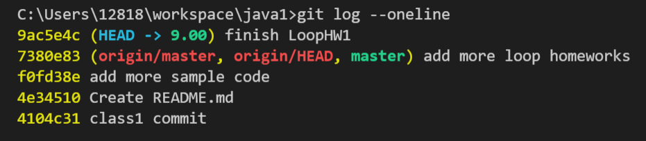
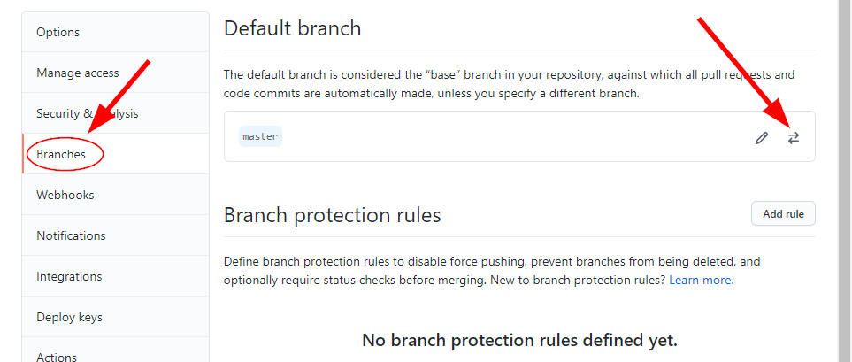

<h1>Git Tricks</h1>

* [Markdown Shared Lib](myIcons.md)

- [Push to github failed](#push-to-github-failed)
- [change github default branch](#change-github-default-branch)
- [Git Push Failed](#git-push-failed)
- [Remove existing branch](#remove-existing-branch)


## Push to github failed

the reason is local branch is **9.00**, the default github branch is **master**, if there is any conflict with github, the push will be rejected.

* git status
```
C:\Users\12818\workspace\java1>git log --oneline
```


, where red is github branch, current branch is 9.00

## change github default branch
1. [github website](https://github.com/jwang1122/java1/settings)
2. select repository > 
3. Click **Settings** > Options: Branches
   
   

## Git Push Failed
❌Git push rejected
```
git push
```
❌ 

✔️Need pull from github, fix confliction, then push again
```
git pull
git push
```

## Remove existing branch
1. open github > select repository
2. click **branches** > trash the branch you want to delete
   