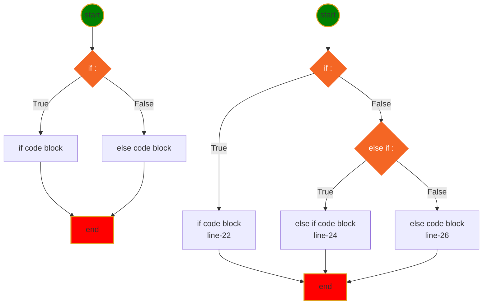
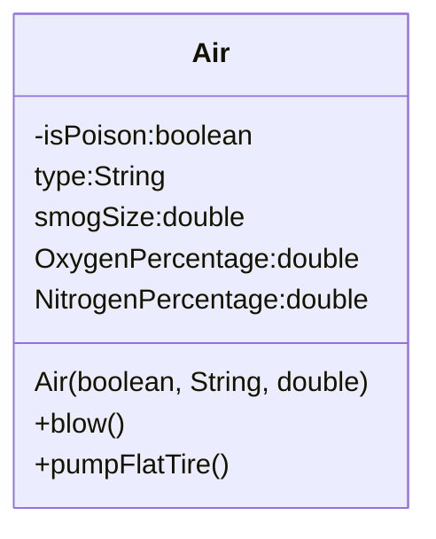
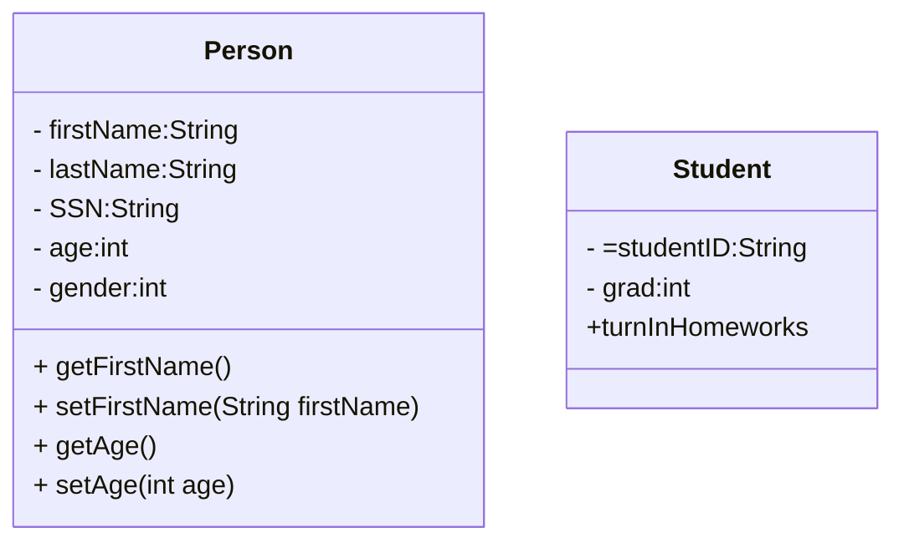

<h1> Java learning Notes </h1>
[](../doc/myIcons.md)

## Table of contents
- [Table of contents](#table-of-contents)
- [Java API Documentation](#java-api-documentation)
- [Variable naming](#variable-naming)
- [Variable and Memory](#variable-and-memory)
- [First Java Program](#first-java-program)
- [Basic skills](#basic-skills)
- [Comments](#comments)
- [Print](#print)
- [Primitive Data Type](#primitive-data-type)
- [Array](#array)
- [ArrayList](#arraylist)
- [Operators](#operators)
- [If-else (execution control)](#if-else-execution-control)
- [Loop](#loop)
	- [For loop](#for-loop)
	- [While loop](#while-loop)
- [Method (Function)](#method-function)
- [Simple Math](#simple-math)
- [Exception](#exception)
- [File Access](#file-access)
- [OOP](#oop)
- [class](#class)
  


## Java API Documentation
[Java API website](https://docs.oracle.com/javase/8/docs/api/)

## Variable naming
1. variable name cannot start with number
```java
int 1a = 0; // 1a is invailid variable name, cause Syntax error
```
2. variable can only start with letter combined with letter and number _, a-z, A-Z, 0-9, no other special characters.
3. prefer camel style: firstName, it is used for variables, method name.
4. cannot use reserved java key words and existing class name for variable name.


[Java Reserve Keywords](https://docs.oracle.com/javase/tutorial/java/nutsandbolts/_keywords.html)

## Variable and Memory

The computer memory is something similar as Chinese medicine drawer. You can put something in the drawer. and then you can get what yuo put in, the only difference is, once you put stuff in the computer memory, you can get as many as you want; but the medicine drawer will be empty once you take out too much.


create a variable just like put a label on the drawer, so you can put more than one labels on the same drawer, or no label at all

## First Java Program
[Hello.java](../../hongkai/src/com/huaxia/hongkai/Hello.java)
```java
class Hello {
	// my main method to run this class
	public static void main(String[] options) {
		System.out.println("Hello, World!");
	}

}
```

## Basic skills
* ❓What is the method signature?
>✔️1. method name; 2. argument type and number of arguments; 3. maybe return type
* ❓What are the modifiers?
>✔️

* ❓Can I rename main method?
>✔️

* ❓How to create a package?
>✔️Right-click **src** folder > New > Package > enter package name

* ❓How to create Java Class?
>✔️

* ❓How to run java class?
>✔️

* ❓How to rename a class file?
>✔️

## Comments
* Single line comment
```java
// this is single line comment
int a = /* assign value 10 to a*/ 10;
int b = 5; // add comment after code
```
* Multiple lines comment
```java
/**
This is multiple line
comment.
*/
```

## Print
* [System.out.print](../../hongkai/src/com/huaxia/hongkai/Print.java)
* System.out.println(String);
* System.out.print(String);
* System.out.printf(format, args);


## Primitive Data Type
[Data Type](../../hongkai/src/com/huaxia/hongkai/DataType.java)
```java
	boolean flag = false; // true, false
	byte myByte = 127; // 8 bits, -128~127
	char c = 'A'; // ASCII:American Standard Code for Information Interchange, 7 bits
	short myShort = 128;
	int a = 1234542345; // int is data type of integer
	long l = 123454234563242L; // put L, or l, on the end
	float x = 129.3F; // f or F on the end
	double y = 12.3;
```
## Array
Array is a special data type, which contains a list of elements of all kinds of data types. (int[], String[], Hello[])
* [Array.java](../src/com/huaxia/hongkai/Array.java)

## ArrayList
ArrayList is JDK build in class, which is resizable-array implementation of the List interface.

the element inside the ArrayList is ordered, which means each element on specific index.

CRUD on ArrayList
* [](../src/com/huaxia/hongkai/MyArrayList.java)

## Operators
* [Operator](../../hongkai/src/com/huaxia/hongkai/Operators.java)
* Arithmetic operator +, -, *, /, %
* Compound assignment operator +=, -=, *=, /=, %=
* Binary operator ++, --
* Comparison Operator >, <, >=, <=, ==, !=
* Logical Operator  && and, || or, ! not
* Ternary Operator a>b?a:b

## If-else (execution control)

From Instructor to Everyone:  09:23 AM


* [if-else if-else](../../hongkai/src/com/huaxia/hongkai/IfElse.java)
* [Switch](../src/com/huaxia/hongkai/Switch.java)

## Loop
### For loop


### While loop


* [for/while loop](../../hongkai/src/com/huaxia/hongkai/Loop.java)

---
[Table of contents](#table-of-contents)

## Method (Function)
* method has signature(fingerprint)
* method overloading
* ❓What is a static way of calling a method
* ✔️Use class name to call static method
* [Method in java](../src/com/huaxia/hongkai/Method.java)
* [Use the class within the same package](../src/com/huaxia/hongkai/TestMethod.java)
>privatr method can only be called inside the class, and default method can be called within the same package, and public method can be called anywhere.
* [Test code on different package](../src/com/huaxia/test/TestMethod.java)

## Simple Math

## Exception

## File Access

## OOP
* Object Oriented Programming concept
  
1. Encapsulation: 
>private modifier make variable or method in the class can only be used within the class, which makes encapsulation possible.
2. Abstraction: abstract object in the real world to write a class
	

[First Class](../src/com/huaxia/hongkai/Air.java)

3. Inheritance: sub class inherit features from super class

## class