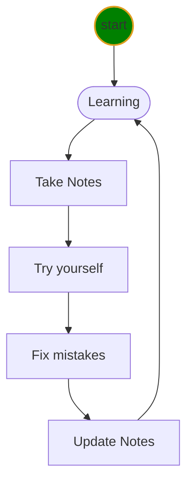

# My class notes

* check installation
    1. check JDK

```DOS
java -version
javac -version
```
    2. check git version

```DOS
git --version
```
    3. Check installation on Eclipse
>Double-click eclipse icon on Desktop

* My first Java program

```java
public class Hello {
    // my main method to run this class
    public static void main(String[] args) {
        System.out.println("Hello, World!");
    }

}
```


## Learning Life Cycle
