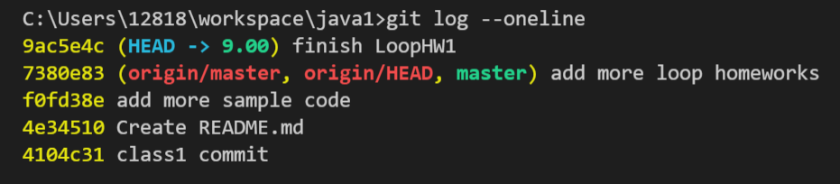
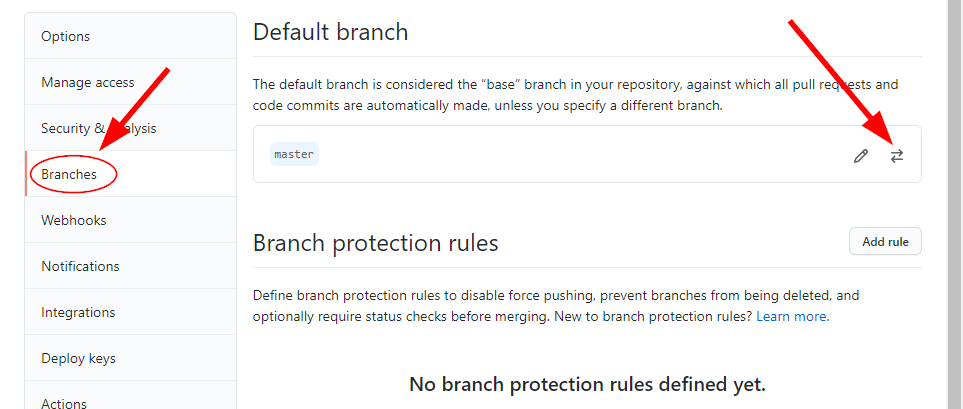
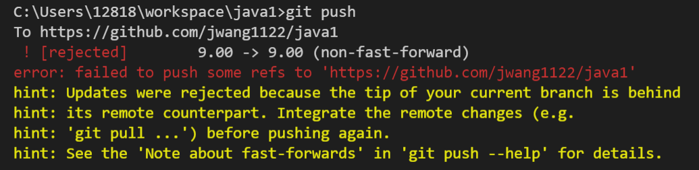

<h1>Git Tricks</h1>

* [Markdown Shared Lib](myIcons.md)

- [Push to github does NOT work](#push-to-github-does-not-work)
- [change github default branch](#change-github-default-branch)


## Push to github does NOT work
* git status
```
C:\Users\12818\workspace\java1>git log --oneline
```


, where red is github branch, current branch is 9.00

## change github default branch
1. [github website](https://github.com/jwang1122/java1/settings)
2. select repository > 
3. Click **Settings** > Options: Branches
   
   

```
git push
```


