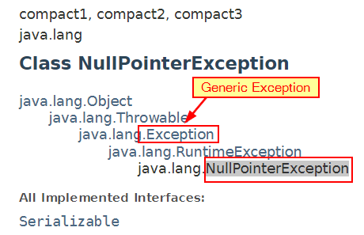

<h1> Java learning Notes </h1>
[Markdown Shared](myIcons.md)

## Table of Contents
- [Table of Contents](#table-of-contents)
- [Java API Documentation](#java-api-documentation)
- [First Java Program](#first-java-program)
- [Getting Start](#getting-start)
- [Basic skills(questions and answers)](#basic-skillsquestions-and-answers)
- [Variable naming](#variable-naming)
- [Variable and Memory](#variable-and-memory)
- [Comments](#comments)
- [Print](#print)
- [Primitive Data Type](#primitive-data-type)
- [Array](#array)
- [ArrayList](#arraylist)
- [Operators](#operators)
- [If-else (execution control)](#if-else-execution-control)
- [Loop](#loop)
	- [For loop](#for-loop)
	- [While loop](#while-loop)
- [>Homework: make code change to two players compete each other.](#homework-make-code-change-to-two-players-compete-each-other)
- [Method (Function)](#method-function)
- [Simple Math](#simple-math)
- [Exception and how to catch it](#exception-and-how-to-catch-it)
- [File Access](#file-access)
- [OOP](#oop)
- [class](#class)
	- [Construtor](#construtor)
	- [Class Inheritance](#class-inheritance)
	- [Interface](#interface)
- [Unit test](#unit-test)
- [Logging](#logging)
- [Blackjack Card Game](#blackjack-card-game)
  


## Java API Documentation
[Java API website](https://docs.oracle.com/javase/8/docs/api/)

## First Java Program
[Hello.java](../src/com/huaxia/java1/Hello.java)
```java
class Hello {
	// my main method to run this class
	public static void main(String[] options) {
		System.out.println("Hello, World!");
	}

}
```

## Getting Start
❓✔️❌
## Basic skills(questions and answers)
* ❓What is the method signature?
>✔️1. method name; 2. argument type and number of arguments; 3. maybe return type
* ❓What are the modifiers?
>✔️public, private, static, protected

* ❓Can I rename main method?
>✔️No, you cannot!

* ❓How to create a package?
>✔️Right-click **src** folder ⟹ New ⟹ Package ⟹ enter package name

* ❓How to create Java Class?
>✔️Right-click package name ⟹ New ⟹ Class ⟹ enter class name

* ❓How to run java class?
>✔️there are 3 ways to run
	1. Click green run button on toolbar
	2. Click Run menu ⟹ Run As ⟹Java Application
	3. Right-click in Editor window ⟹ Run As ⟹ Java Application

* ❓How to rename a class file?
>✔️Right-Click file name on Explore ⟹ Refactor ⟹ Rename

* ❓How do I configure the Run environment?
>✔️There are more than one to do this
	- Click the dropdown button beside green run button on toolbar ⟹ Run Configurations
	- Run menu ⟹ Run Configurations...
	- Right-click in Editor window ⟹ Run As ⟹ Run Configurations...
* ❓What is 'Run Configurations'?
```answer
	✔️
	1. configure the main class (the class has main() method)
	2. insert runtime arguments
	3. pick different JRE library
	4. modify dependencies
	5. more ...
```
* ❓How many different comment? and What comment can do?
>✔️

* ❓How do I closs all other open files except my edit file?
>✔️

## Variable naming
1. variable name cannot start with number
```java
int 1a = 0; // 1a is invailid variable name, cause Syntax error
```
2. variable can only start with letter combined with letter and number _, a-z, A-Z, 0-9, no other special characters.
3. prefer camel style: firstName, it is used for variables, method name.
4. cannot use reserved java key words and existing class name for variable name.


[Java Reserve Keywords](https://docs.oracle.com/javase/tutorial/java/nutsandbolts/_keywords.html)

## Variable and Memory


The computer memory is something similar as Chinese medicine drawer. You can put something into the drawer, and then you can get what you put in. The only difference is, once you put stuff in computer memory, you can get as many as you want; but the medicien drawer will be empty one you take out too much. 


create a variable just like put a label on the drawer. so you can put more than one labels on the same drawer, or no label at all.

## Comments
* Single line comment
```java
// this is single line comment
int a = /* assign value 10 to a*/ 10;
int b = 5; // add comment after code
```
* Multiple lines comment
```java
/**
This is multiple line
comment.
*/
```

---
[Table of Contents](#table-of-contents)

## Print
* [System.out.print](../src/com/huaxia/java1/Print.java)
* System.out.println(String);
* System.out.print(String);
* System.out.printf(format, args);


## Primitive Data Type
[Data Type](../src/com/huaxia/java1/DataType.java)
```java
	boolean flag = false; // true, false
	byte myByte = 127; // 8 bits, -128~127
	char c = 'A'; // ASCII:American Standard Code for Information Interchange, 7 bits
	short myShort = 128;
	int a = 1234542345; // int is data type of integer
	long l = 123454234563242L; // put L, or l, on the end
	float x = 129.3F; // f or F on the end
	double y = 12.3;
```
The above data is in the order of the container size.

You can assign small value to bigger container, but cannot assign big value to smaller container. If you know what you are doing, you can cast big value to smaller container, which may truncat your data.

## Array
Array is a special data type, which contains a list of element of all kinds data type. (int[], String[], Hello[])
* [Array.java](../src/com/huaxia/java1/Array.java)
* Sort integer Array: Arrays.sort(<array>)
* Sort String Array: Arrays.sort(<String array>)
* Sort Any class you defined(Hello): Arrays.sort(), implements Comparable ⟹ create compareTo(Object obj) method in your class(Hello). Then sort by name, or by age, which are different attributes of the Hello class. [Hello.java](../src/com/huaxia/java1/Hello.java)
  
## ArrayList
ArrayList is JDK build in class, which is resizable-array implementation of the List interface.

the element inside the ArrayList is ordered, which means each element on specific index.

CRUD (Create, Retrieve, Update, Delete) on ArrayList, ArrayList is mutable.

* [MyArrayList.java](../src/com/huaxia/java1/MyArrayList.java)
* Sort ArrayList: Collections.sort(<arraylist>)

## Operators
* [Operator](../src/com/huaxia/java1/Operator.java)
* Arithmetic operator +, -, *, /, %
* Compound assignment operator +=, -=, *=, /=, %=
* Binary operator ++, --
* Comparison Operator >, <, >=, <=, ==, !=
* Logical Operator  && and, || or, ! not
* Ternary Operator a>b?a:b

## If-else (execution control)


* [if, if-else, if-else if-else](../src/com/huaxia/java1/IfElse.java)
* [Switch](../src/com/huaxia/java1/Switch.java)
  
## Loop
### For loop


### While loop
    


* [for/while loop](../src/com/huaxia/java1/Loop.java)

* [Guess number game](../src/com/huaxia/java1/GuessNumber.java)

>Homework: make code change to two players compete each other.
---
[Table of Contents](#table-of-contents)


## Method (Function)
* method has signature (finger print)
* method overloading (same name different signature)
* ❓What is a static way of calling a method?
* ✔️Use class name to call static method.
* [Method in Java](../src/com/huaxia/java1/Method.java)
* [Use the class within same package](../src/com/huaxia/java1/TestMethod.java)
>private method can only be called inside the class, and default method can be called within the same package, and public method can be called anywhere.
* [Test code on different package](../src/com/huaxia/test/TestMethod.java)


## Simple Math
* [Simple math: add, random, ](../src/com/huaxia/java1/SimpleMath.java)

## Exception and how to catch it

❓Why we need try-catch block?
>✔️

❓Why Exception in SimpleMath cause compiler error?
>✔️

❓Why Exception is generic Exception?
>✔️All other Exception classes extends (**inherits**) from Exception class, catch Exception will catch them all.


1. catch generic Exception will catch all kinds of Exceptions
2. you can catch specific Exception by specific name such as NullPointerException on purpose.
3. you can catch more than one specific Exceptions

[Exception](../src/com/huaxia/java1/Exception.java)

## File Access

## OOP
Object Oriented Programming concept

  
1. Encapsulation: private, protected, protect outside class using the attributes or methods unintentionally.
❓What is private modifier?
>✔️private modifier make variable or method in the class can only be used within the class, which makes encapsulation possible.
2. Abstraction: abstract object in the real world to write a class.
  
[First class](../src/com/huaxia/java1/Air.java)

3. Inheritance: subclass inherits features from super class.


Student is a Person, the relationship between Student and Person is **is relation**.
where the Student class is subclass of Person class, we call the Person as Superclass of Student class.

* [Person, Superclass](../src/com/huaxia/java1/Person.java)
* [Student, Subclass of Person](../src/com/huaxia/java1/Student.java)
* [Teacher, Subclass of Person](../src/com/huaxia/java1/Teacher.java)

4. Polymorphism: give different answer for the same question from different classes which inherit from same superclas or interface. (异类同功)
   
[Test Polymorphism](../src/com/huaxia/test/TestMethod.java)

## class
❓What functions defined in Object class which are useful for us?
✔️the functions available in Object are
1. default constructor
2. toString()

❓What is construtor?
✔️Constructor is used to create an instance of the class.
### Construtor
1. Constructor looks like a method which does NOT have return type since it always return the instance.
2. Constructor can use public, package, private and protected modifier
3. 😢👎If you defined your own constructor with arguments, the default constructor no longer works
	- ✔️create a default constructor which does **NOT** have any aruments.
	- ✔️add arguments when you call the constructor
4. 👌You can define many different constructors which has different signature. 
5. 😢Subclass can NOT use Superclass constructor.
6. 😄Subclass can use public or protected methods defined in the superclass.
7. 😢👎👎👎class defined in the same package can call protected method.
8. 👍protected method cannot be called from different package.

### Class Inheritance
❓What is protected modifier?
✔️protected modifier allow subclass to access the superclass attributes or methods. protect from using by other classes.

[getter, setter, toString, default constructor](../src/com/huaxia/java1/Superclass1.java)

❓How do I create getter/setter?
✔️Right-Click where you want code generated ⟹ Source ⟹ Generate Getters/Setters...

❓How do I override toString() method?
✔️Right-Click where you want code generated ⟹ Source ⟹ Generate toString()...

❓Why I want to override toString()?
✔️because each object want to have their own representation.

* Subclass1 inherits from Superclass1 
[Inherits attribute and mothod but not constructor](../src/com/huaxia/java1/Subclass1.java)
💡❗️ In Java, it is not allowed multiple class inheritance, in other word, any class can only extends from one superclass.

### Interface
❓What is interface?
✔️An interface is a completely "abstract class" that is used to group related methods signature without implementation.(with 😢empty bodies.) 👍collection of definition of methods.

[Occupation](../src/com/huaxia/java1/Occupation.java)

❓How do I create interface?
✔️Right-click the package name ⟹ New ⟹ interface (or toolbar) 

1. use **interface** keyword and interface name and {} to define an interface.
2. 😄I cannot instantiate an interface.
3. interface can define more than one abstract public methods.
4. interface cannot implement method or get compiler error(Abstract methods do not specify a body).
5. interface only defined abstract methods, all methods are public.
6. you can define constant fields in interface.

❓How do I use the interface?
✔️**implements** the interface by class, a class can implements more than one interfaces.

👇see the following sample code.
[Person.java](../src/com/huaxia/java1/Person.java)

5. 👇use **abstract** modifier to make the class abstract which allow no implementation of the abstract method defined in interface.👇see the following sample code.
[Person.java](../src/com/huaxia/java1/Person.java)

❓How do I implements unimplemented method?
✔️Right-Click where you want code generated ⟹ Source ⟹ Override/implements Methods...

❓What is abstract class?
✔️Abstract class are similar to interfaces, you cannot instantiate them, and they may contain a mix of methods declared with or without an implementation. (to access those method, it must be inherited from another class)

👇see the following sample code, it has getOccupation() and add() methods without emplementation and compareTo() implemented.

[Person.java](../src/com/huaxia/java1/Person.java)

1. it can define abstract method; 
2. Cannot to be instantiated(Cannot instantiate the type Person); 
3. only implements common used methods.
[TestMethod.java](../src/com/huaxia/java1/TestMethod.java)

❓What is abstract method?
✔️

❓Which should I use, abstract class? or interface?
✔️👇Consider using abstract class if any of these following statemens apply to your situation:
1. I wang to share code among several closely related classes.
2. I expect that classes that extend my abstract class have many common methods of fields, or require access modifiers other than public.
3. I want to declare non-static or non-final fileds. This enables I to define methods that can acess and modify the state of the object to which they belong.
✔️👇Consider using interfaces if any of these statements apply to my situation:
1. I expect that unrelated classes would implement my interface. For example, the Comparable<T>
2. I want to specify the behavior of a particular data type (class), but not concern about who implements its behavior.
3. I want to take advantage of mulpile inheritance of data type(class) (🔥polymorphism) 👇see sample code below👇.

[Person.java](../src/com/huaxia/java1/Person.java)

[TestMethod.java](../src/com/huaxia/java1/TestMethod.java)

## Unit test

## Logging

## Blackjack Card Game