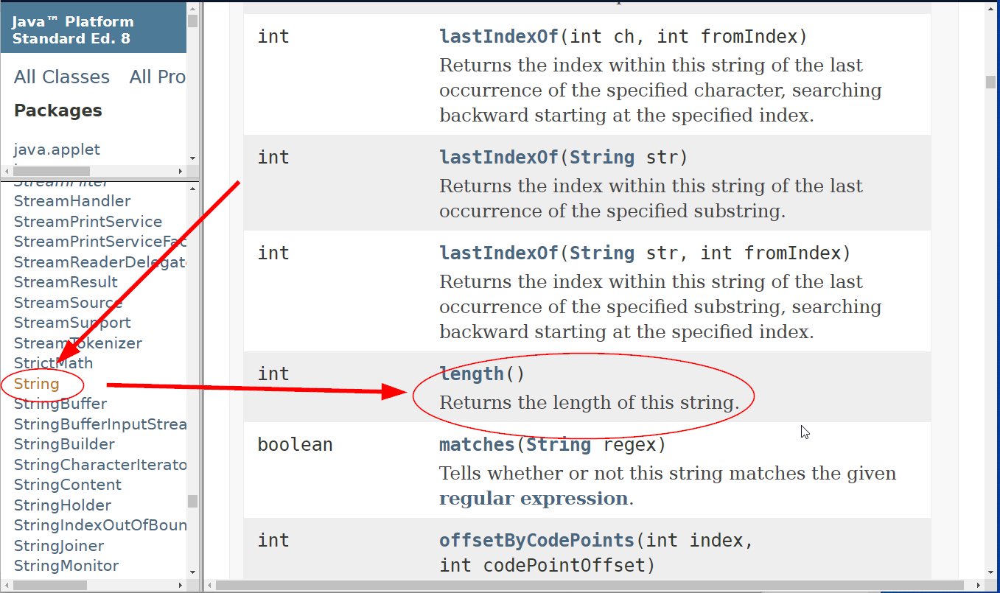

<h1>My Questions and Anwsers</h1>

[Markdown Shared Lib](../../java1/doc/myIcons.md)

❓How do I find number of letters in a string?

✔️ to get number of letters of a string, call **length()** method.
```java
    String s = "Hello";
    int numOfLetters = s.length();
    System.out.println(numOfLetters);
```
Expected out: 5

❓How do I know there is a **length()** method for a String?

>✔️ Two answers below👇
    1. Ask your teacher
    2. [JDK API Website](https://docs.oracle.com/javase/8/docs/api/)
        - scroll down **All Classes** find **String**
        - scroll down **Method Summary** find **length()**
    
    This is a better way, sence you are not only find document about **length()** method, you also find other interesting methods you may need.

❓Why I always get **terminated** while I am running java program?

>✔️ When the program finish running, Eclipse will show **terminated**. If you 
[](../../java1/doc/myIcons.md)

don **NOT** print out anything, there will be no output on the console at all.

For example,
```java
	public static void main(String[] args) {
		int a = 5;
		int b = 19;
		int c = a + b;
	}
```
this block of code will terminated without anything displayed on console.