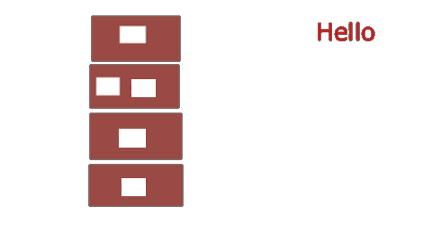
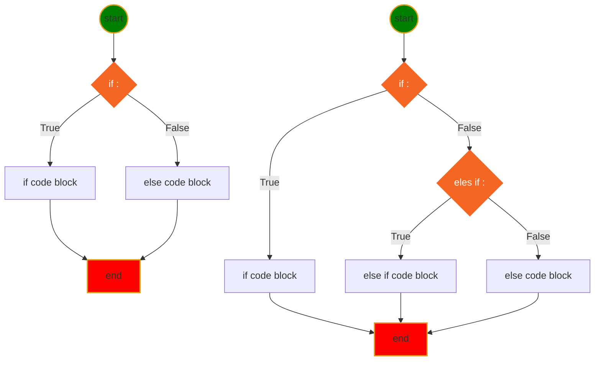
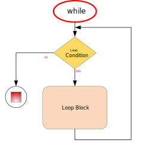
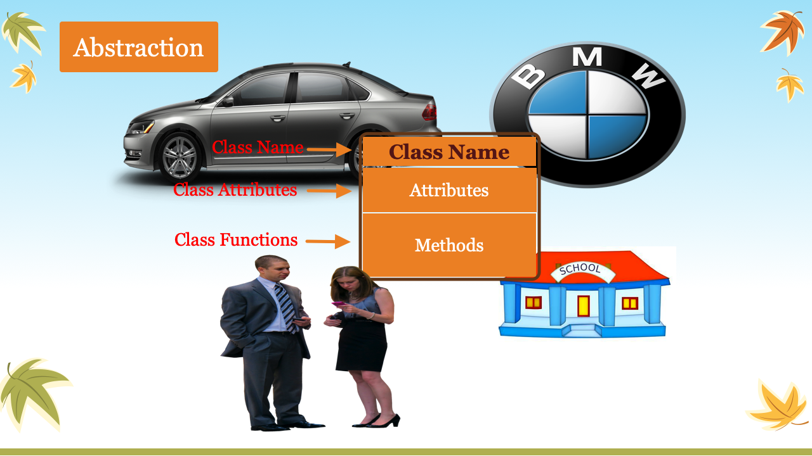
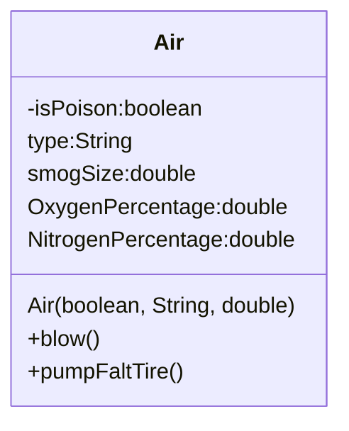
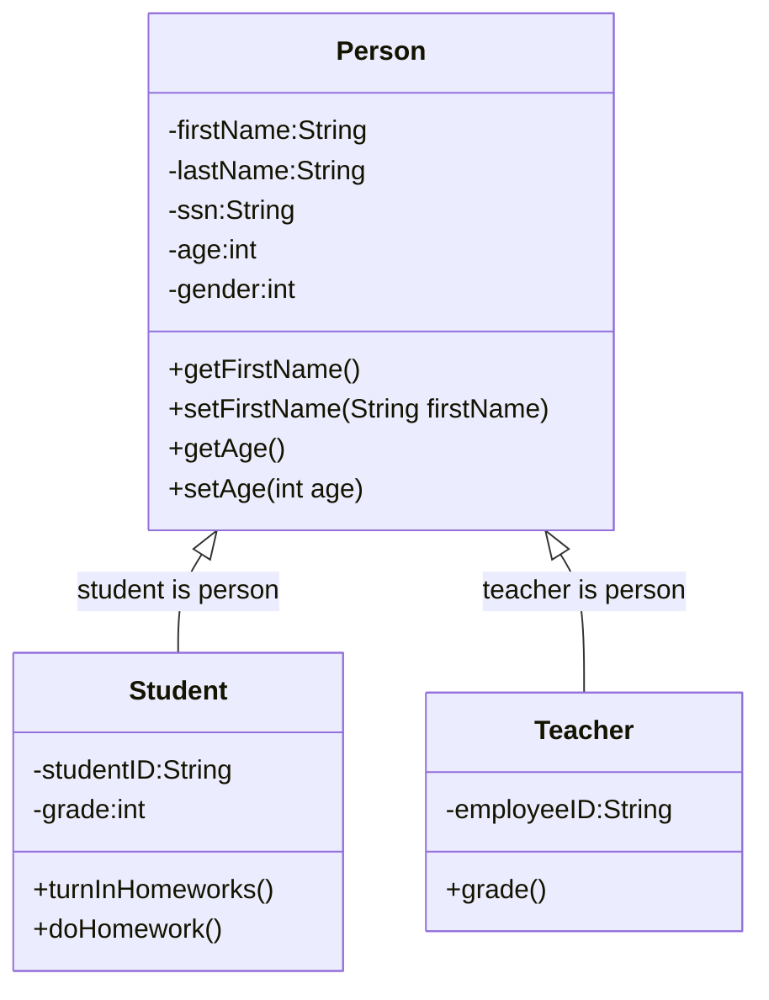

<h1> Java learning Notes </h1>

## Table of Contents
- [Table of Contents](#table-of-contents)
- [Java API Documentation](#java-api-documentation)
- [Variable naming](#variable-naming)
- [Variable and Memory](#variable-and-memory)
- [First Java Program](#first-java-program)
- [Basic skills](#basic-skills)
- [Comments](#comments)
- [Print](#print)
- [Primitive Data Type](#primitive-data-type)
- [Array](#array)
- [ArrayList](#arraylist)
- [Operators](#operators)
- [If-else (execution control)](#if-else-execution-control)
- [Loop](#loop)
	- [For Loop](#for-loop)
	- [While Loop](#while-loop)
- [Method (Function)](#method-function)
- [OOP](#oop)
- [Class](#class)
  


## Java API Documentation
[Java API website](https://docs.oracle.com/javase/8/docs/api/)

## Variable naming
1. variable name cannot start with number
```java
int 1a = 0; // 1a is invailid variable name, cause Syntax error
```
2. variable can only start with letter combined with letter and number _, a-z, A-Z, 0-9, no other special characters.
3. prefer camel style: firstName, it is used for variables, method name.
4. cannot use reserved java key words and existing class name for variable name.


[Java Reserve Keywords](https://docs.oracle.com/javase/tutorial/java/nutsandbolts/_keywords.html)

## Variable and Memory


The computer memory is something similar as Chinese medicine drawer. You can put something into the drawer, and then you can get what you put in. The only difference is, once you put stuff in computer memory, you can get as many as you want; but the medicien drawer will be empty one you take out too much.


create a variable just like put a label on the drawer. so you can put more than one labels on the same drawer, or no label at all.

## First Java Program
[Hello.java](../src/com/huaxia/java1/Hello.java)
```java
class Hello {
	// my main method to run this class
	public static void main(String[] options) {
		System.out.println("Hello, World!");
	}

}
```
❓✔️❌
## Basic skills
* ❓What is the method signature?
>✔️1. method name; 2. argument type and number of arguments; 3. maybe return type

* ❓What are the modifiers?
>✔️public, private, static, protected

* ❓Can I rename main method?
>✔️No

* ❓How to create a package?
>✔️Right-click **src** folder ⟹ New ⟹ Package ⟹ enter package name

* ❓How to create Java Class?
>✔️Right-click package name ⟹ New ⟹ Class ⟹ Enter Class Name

* ❓How to run java class?
>✔️There are 3 ways to run
	1. Click green run button on tool bar
	2. Click Run menu ⟹ Run As ⟹ Java Application
	3. Right-click in Editor window ⟹ Run As ⟹ Java Application

* ❓How to rename a class file?
>✔️Right-click file name on Explore ⟹ Refractor ⟹ Reanme

* ❓How do I configure the Run enviroment?
>✔️There are more than one ways to do this
	- Click the dropdown button beside green run button on toolbar ⟹ Run Configurations
	- Run menu ⟹ Run Configurations
	- Right-click in Editor window ⟹ Run As ⟹ Run Configurations...

* ❓What is Run Configurations
    1. Configure the main class (the class has main() method)
    2. insert runtime arguments
    3. pick different JRE library
    4. modify dependencies
    5. more...


## Comments
* Single line comment
```java
// this is single line comment
int a = /* assign value 10 to a*/ 10;
int b = 5; // add comment after code
```
* Multiple lines comment
```java
/**
This is multiple line
comment.
*/
```

---
[Table of Contents](#table-of-contents)

## Print
* [System.out.print](../src/com/huaxia/java1/Print.java)
* System.out.println(String);
* System.out.print(String);
* System.out.printf(format, args);


## Primitive Data Type
[Data Type](../src/com/huaxia/java1/DataType.java)
```java
	boolean flag = false; // true, false
	byte myByte = 127; // 8 bits, -128~127
	char c = 'A'; // ASCII:American Standard Code for Information Interchange, 7 bits
	short myShort = 128;
	int a = 1234542345; // int is data type of integer
	long l = 123454234563242L; // put L, or l, on the end
	float x = 129.3F; // f or F on the end
	double y = 12.3;
```
The above data is in the order of the container size.

You can assign small value to bigger container, but cannot assign big value to smaller container. If you know what you are doing, you can cast big value to smaller container, which may truncation your data.

## Array
Array is a special data type, which contains a list of element of all kinds data type.(int[], String[], Hello[])
[Array.java](../src/com/huaxia/sarah/Array.java)

## ArrayList
ArrayList is JDK biuld in class, which is resizable-array implementation of List interface

the element inside the ArrayList is ordered, which means each element on specific index

CRUD (Create, Retrieve, Update, Delete) on ArrayList, ArrayList is mutable

[MyArrayList.java](../src/com/huaxia/sarah/MyArrayList.java)

## Operators
* [Operator](../src/com/huaxia/java1/Operator.java)
* Arithmetic operator +, -, *, /, %
* Compound assignment operator +=, -=, *=, /=, %=
* Binary operator ++, --
* Comparison Operator >, <, >=, <=, ==, !=
* Logical Operator  && and, || or, ! not
* Ternary Operator a>b?a:b
* [Switch](../src/com/huaxia/sarah/Switch.java)

## If-else (execution control)
* [if, if-else, if-else if-else](../src/com/huaxia/java1/IfElse.java)



## Loop
### For Loop


### While Loop




* [for/while loop](../src/com/huaxia/java1/Loop.java)

---
[Table of Contents](#table-of-contents)

## Method (Function)
* method has signature (finger print)
* method overloading
* ❓What is a static way of calling a method?
* ✔️Use class name to call static method
[Method](../src/com/huaxia/sarah/Method.java)
[Use the class within same package](../src/com/huaxia/sarah/TestMethod.java)
>private method can only be called inside the class, and default method can be called within the same package, and public method can be called anywhere
*[Test code on different package](../src/com/huaxia/sarah/test/TestMethod.java)

## OOP
* Object Oriented Programming concept

  
1. Encapsualtion: private, protected
❓What is a private modifier?
>✔️private modifier make variable or method in the class can only be used within the class, which makes encapsulation possible.
2. Abstraction: abstract object in the real world to write a class.
  
[First Class](../src/com/huaxia/sarah/Air.class)

3. Inheritance: subclass inherits features from super class

  ## Class