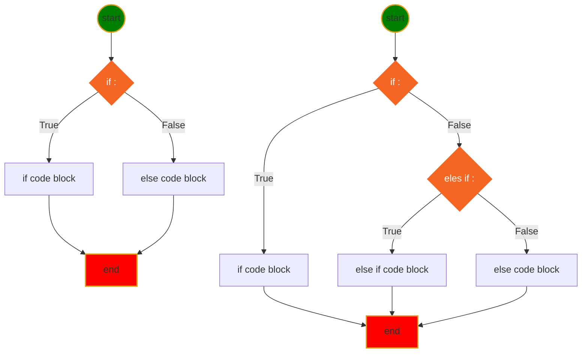
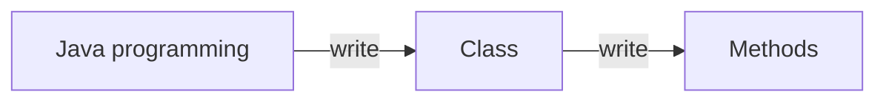
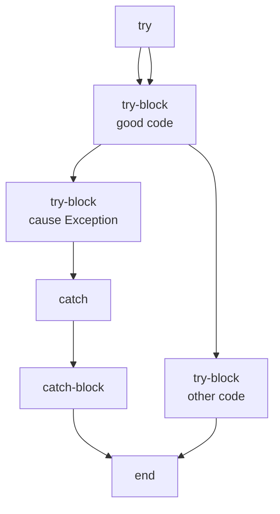
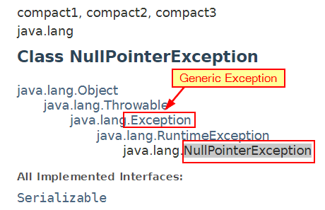
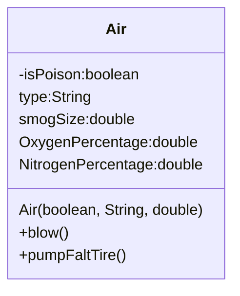
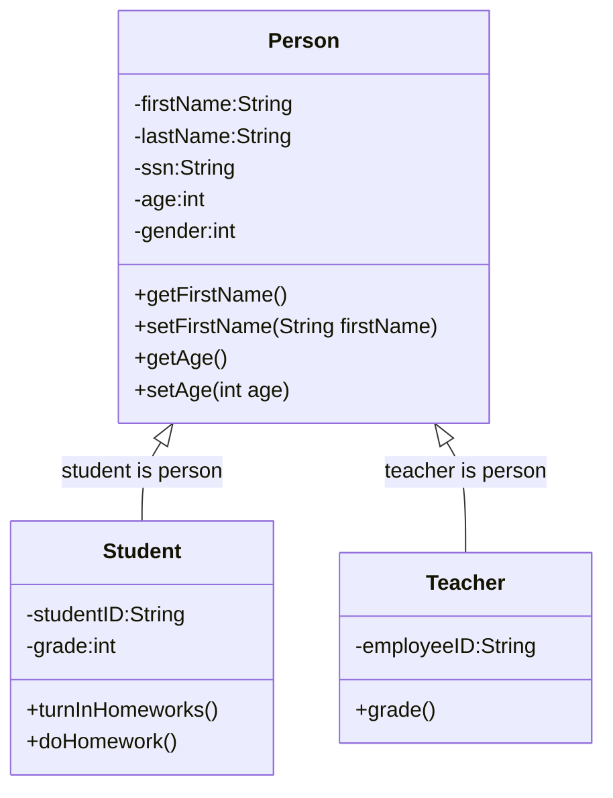

<h1> Java learning Notes </h1>

## Table of Contents
- [Table of Contents](#table-of-contents)
- [Java API Documentation](#java-api-documentation)
- [Variable naming](#variable-naming)
- [Variable and Memory](#variable-and-memory)
- [First Java Program](#first-java-program)
- [Basic skills](#basic-skills)
- [Comments](#comments)
- [Print](#print)
- [Primitive Data Type](#primitive-data-type)
- [Array](#array)
- [ArrayList](#arraylist)
- [Operators](#operators)
- [If-else (execution control)](#if-else-execution-control)
- [Loop](#loop)
	- [For Loop](#for-loop)
	- [While Loop](#while-loop)
- [Method (Function)](#method-function)
- [Simple Math](#simple-math)
- [Exception and hoe to catch it](#exception-and-hoe-to-catch-it)
- [File Access](#file-access)
- [OOP](#oop)
- [Class](#class)
	- [Constructor](#constructor)
	- [Class Inheritance](#class-inheritance)
- [Interface](#interface)
- [Unit Test](#unit-test)
  


## Java API Documentation
[Java API website](https://docs.oracle.com/javase/8/docs/api/)

## Variable naming
1. variable name cannot start with number
```java
int 1a = 0; // 1a is invailid variable name, cause Syntax error
```
2. variable can only start with letter combined with letter and number _, a-z, A-Z, 0-9, no other special characters.
3. prefer camel style: firstName, it is used for variables, method name.
4. cannot use reserved java key words and existing class name for variable name.


[Java Reserve Keywords](https://docs.oracle.com/javase/tutorial/java/nutsandbolts/_keywords.html)

## Variable and Memory


The computer memory is something similar as Chinese medicine drawer. You can put something into the drawer, and then you can get what you put in. The only difference is, once you put stuff in computer memory, you can get as many as you want; but the medicien drawer will be empty one you take out too much.


create a variable just like put a label on the drawer. so you can put more than one labels on the same drawer, or no label at all.

## First Java Program
[Hello.java](../src/com/huaxia/java1/Hello.java)
```java
class Hello {
	// my main method to run this class
	public static void main(String[] options) {
		System.out.println("Hello, World!");
	}

}
```
❓✔️❌
## Basic skills
* ❓What is the method signature?
>✔️1. method name; 2. argument type and number of arguments; 3. maybe return type

* ❓What are the modifiers?
>✔️public, private, static, protected

* ❓Can I rename main method?
>✔️No

* ❓How to create a package?
>✔️Right-click **src** folder ⟹ New ⟹ Package ⟹ enter package name

* ❓How to create Java Class?
>✔️Right-click package name ⟹ New ⟹ Class ⟹ Enter Class Name

* ❓How to run java class?
>✔️There are 3 ways to run
	1. Click green run button on tool bar
	2. Click Run menu ⟹ Run As ⟹ Java Application
	3. Right-click in Editor window ⟹ Run As ⟹ Java Application

* ❓How to rename a class file?
>✔️Right-click file name on Explore ⟹ Refractor ⟹ Reanme

* ❓How do I configure the Run enviroment?
>✔️There are more than one ways to do this
	- Click the dropdown button beside green run button on toolbar ⟹ Run Configurations
	- Run menu ⟹ Run Configurations
	- Right-click in Editor window ⟹ Run As ⟹ Run Configurations...

* ❓What is Run Configurations
```
    1. Configure the main class (the class has main() method)
    2. insert runtime arguments
    3. pick different JRE library
    4. modify dependencies
    5. more...
```

* ❓How many different comments? and What comments can do?
>✔️

* ❓How do I close all other open files except my editor file?
>✔️

## Comments
* Single line comment
```java
// this is single line comment
int a = /* assign value 10 to a*/ 10;
int b = 5; // add comment after code
```
* Multiple lines comment
```java
/**
This is multiple line
comment.
*/
```

---
[Table of Contents](#table-of-contents)

## Print
* [System.out.print](../src/com/huaxia/java1/Print.java)
* System.out.println(String);
* System.out.print(String);
* System.out.printf(format, args);


## Primitive Data Type
[Data Type](../src/com/huaxia/java1/DataType.java)
```java
	boolean flag = false; // true, false
	byte myByte = 127; // 8 bits, -128~127
	char c = 'A'; // ASCII:American Standard Code for Information Interchange, 7 bits
	short myShort = 128;
	int a = 1234542345; // int is data type of integer
	long l = 123454234563242L; // put L, or l, on the end
	float x = 129.3F; // f or F on the end
	double y = 12.3;
```
The above data is in the order of the container size.

You can assign small value to bigger container, but cannot assign big value to smaller container. If you know what you are doing, you can cast big value to smaller container, which may truncation your data.

## Array
Array is a special data type, which contains a list of element of all kinds data type.(int[], String[], Hello[])
* [Array.java](../src/com/huaxia/sarah/Array.java)
* Sort Integer Array: Arrays.sort(<array>)
* * Sort String Array: Arrays.sort(<String array>)
* * Sort Any class you defined(Hello): Arrays.sort(), implements Comparable ⟹ create compareTo(Object obj) method in your class(Hello). Then sort by name, or by age, which are different attributes of the Hello class. [Hello.java](../src/com/huaxia/sarah/Hello.java)

## ArrayList
ArrayList is JDK biuld in class, which is resizable-array implementation of List interface

the element inside the ArrayList is ordered, which means each element on specific index

CRUD (Create, Retrieve, Update, Delete) on ArrayList, ArrayList is mutable

* [MyArrayList.java](../src/com/huaxia/sarah/MyArrayList.java)
* Sort ArrayList: Collection.sort(<arrayList>)

## Operators
* [Operator](../src/com/huaxia/java1/Operator.java)
* Arithmetic operator +, -, *, /, %
* Compound assignment operator +=, -=, *=, /=, %=
* Binary operator ++, --
* Comparison Operator >, <, >=, <=, ==, !=
* Logical Operator  && and, || or, ! not
* Ternary Operator a>b?a:b
* [Switch](../src/com/huaxia/sarah/Switch.java)

## If-else (execution control)
* [if, if-else, if-else if-else](../src/com/huaxia/java1/IfElse.java)



## Loop
### For Loop


### While Loop


* [for/while loop](../src/com/huaxia/java1/Loop.java)

* [Guess Number Game](../src/com/huaxia/sarah/GuessNumber.java)

>HW: make code change to two player compete each other

---
[Table of Contents](#table-of-contents)



## Method (Function)
* method has signature (finger print)
* method overloading
* ❓What is a static way of calling a method?
* ✔️Use class name to call static method
[Method](../src/com/huaxia/sarah/Method.java)
[Use the class within same package](../src/com/huaxia/sarah/TestMethod.java)
>private method can only be called inside the class, and default method can be called within the same package, and public method can be called anywhere
*[Test code on different package](../src/com/huaxia/sarah/test/TestMethod.java)

## Simple Math
* [Simple math: add, random, ](../src/com/huaxia/sarah/SimpleMath.java)

## Exception and hoe to catch it


❓Why we need to try-catch-block?
>✔️

❓Why Exception in SimpleMath cause compiler error?
>✔️

❓Why Exception is generic Exception?
>✔️All other Exception classes extends (**inherits**) from Exception class, catch Exception will catch them all.


1. catch generic Exception will catch all kinds of Exceptions
2. you can catch specific Exception by specific name such as NullPointerException on purpose.
3. you can catch more than one specific Exceptions

[Exception](../src/com/huaxia/sarah/Exception.java)

## File Access

## OOP
* Object Oriented Programming concept

  
1. Encapsualtion: private, protected, protects from outside class using the attributes or methods unintentionally.
❓What is a private modifier?
>✔️private modifier make variable or method in the class can only be used within the class, which makes encapsulation possible.
2. Abstraction: abstract object in the real world to write a class.
  
[First Class](../src/com/huaxia/sarah/Air.class)

3. Inheritance: subclass inherits features from super class


Student is a Person, the relationship between Student and Person is **is relation**.
Where the Student class is subclass of Person class, we call the Person as Superclass of Student class.

* [Person, Superclass](../src/com/huaxia/sarah/Person.java)
* [Student, Subclass of Person](../src/com/huaxia/sarah/Student.java)
* [Teacher, Subclass of Person](../src/com/huaxia/sarah/Teacher.java)

4. Polymorphism: Give different amswer for the same question from different classes which inherit from same superclass or interface. (异类同功)

[Test Polymorphism](../src/com/huaxia/sarah/test/TestMethod.java)

## Class
❓What functions defined in Object class are useful to us?
✔️the functions available in Object are
1. default constructor
2. toString()

❓ What is constructor?
✔️Constructor is used to create instance of class.

### Constructor
1. Constructor looks like method which does not have return type since it always returns the instance
2. Constructor can use public, package, and protected modifier
3. 😢👎If yoou defined your own constructor with arguments, default constructor no longer works
	-✔️ create default constructor which does **NOT** have any arguments
	-✔️ add arguments when you call constructor
4. 👌You can define different constructors which has different signature.
5. 😢Subclass can NOT use Superclass constructor.
6. 😄Subclass can use public or protected methods defined in suberclass.
7. 😢👎👎👎Class defined in same package can call protected method.
8. 👍protected method cannot be called from different package

### Class Inheritance
❓What is protected modifier?
✔️protected modifier allows subclass to access superclass attributes or methods. protect from using by other classes

[getter, setter, toString, default constructor](../src/com/huaxia/sarah/SuperClass1.java)

❓How do I create getter/setter?
✔️Right-Click where you want code generate ⟹ Source ⟹ generate Getters/Setters...

❓How do i override toString() method?
✔️Right-Click where you want code generated ⟹ Source ⟹ Generate toString()...

❓Why I want to override toString?
✔️because each object want to have their own representative.

* Subclass1 inherits from SuperClass1

[Inherits attribute  and method but not constructor](../src/com/huaxia/sarah/Subclass1.java)
💡❗️In Java, it is not allowed multiple class inheritance, in other words, any class can only extends from one superclass.

## Interface
❓What is interface?
✔️Interface is completely "abstract class" that is used to group related methods signature without implementation (with 😢empty bodies). Collection of definition of methods.

❓How do I create interface?
✔️Right=Click package name  ⟹ New ⟹ Interface

1. Use **interface** keyword and interface name and {} to define an interface
2. 😄Can not instanciate interface.
3. Interface can define more than one abstract public methods.
4. Interface can not implement method or get compiler error(Abstract method do not specify a body).
5. Interface only defined abstract methods, all methods are public.
6. You can define constant fields in interface.

❓How do I use interface?
✔️**Implements** the interface by class

👇 see following sample code
[Person.java](../src/com/huaxia/sarah/Person.java)

5. 👇use **abstract** modifier to make the class abstract which allows no implementation of the abstract method defined in interface. 👇 see following sample code
[Person.java](../src/com/huaxia/sarah/Person.java)

❓How do I define unimplemented method?
✔️Right-Click where you want code generated ⟹ Source ⟹ Override/Implements Methods...

❓What is abstract class?
✔️Abstract class are similar to interface, you cannot instantiate them, and they may contain a mix of methods declared with or wihtout an implementation.(to access those method, it must be inherited from other class)

👇 see following sample code, it has getOccupation() and add() without implementation and compareTo() implemented.

[Person.java](../src/com/huaxia/sarah/Person.java)

1. it can define abstract method; 
2. cannot to be instantiated (Cannot instantiate the type Person); 
3. only implements common used methods
[TestMethod.java](../src/com/huaxia/sarah/TestMethod.java)

❓What is abstract method?
✔️

❓Which should I use: Abstract Class or Interface?
✔️Consider using abstract class if any of the following statements apply to your situation:
1. I want to share code among several closely related classes.
2. I expect that classes that extend my abstract class have many common methods of fields, or require access modifiers other than public.
3. I want to declare non-static or non-final fields. This enables me to define methods that can access and modify the state of the object to which the belong.
✔️Consider using interfaces if any of these statements apply to my situation:
1. I expect that unrelated classes would implement my interface. for example, the Comparable< T >.
2. I want to specify the behavior of a particular data type (class), but not concerned about who implements its behavior.
3. I want to take atvantage of multiple inheritance of data type(class) (🔥polymorphism🔥).👇 see following sample code below

[Person.java](../src/com/huaxia/sarah/Person.java)
[TestMethod.java](../src/com/huaxia/sarah/TestMethod.java)

## Unit Test